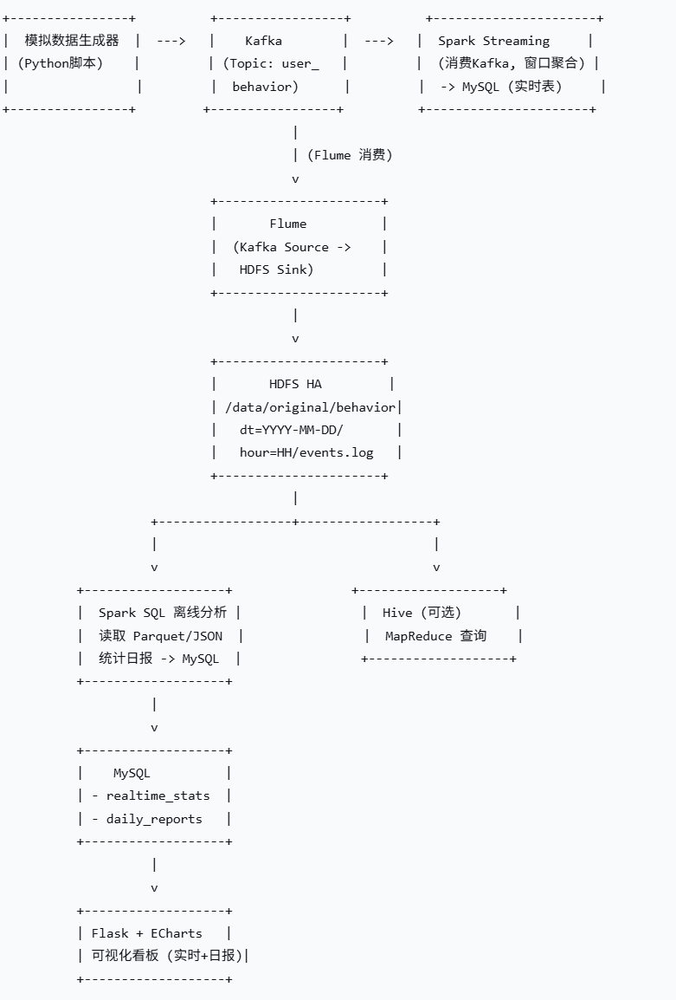

# 电商用户行为实时分析系统

## 项目简介

本项目实现了一个完整的电商用户行为实时 + 离线分析系统。模拟用户点击、加购、购买、收藏等行为，通过 Kafka 传输数据，经 Spark Streaming 实时计算 PV/UV/销售额并写入 MySQL，同时通过 Flume 将原始日志存入 HDFS。离线部分使用 Spark SQL 进行日报分析（每日销售额、Top 商品、用户行为漏斗），最后通过 Flask + ECharts 实现可视化看板。

**技术栈**：
- Hadoop 3.3.4 (HDFS HA + YARN)
- ZooKeeper 3.8.0
- Kafka 3.3.1
- Flume 1.9.0
- Spark 3.3.1 (Streaming + SQL)
- MySQL 8.0
- Flask + ECharts
- Python 3.6+ / Scala 2.12

## 系统架构



**数据流**：
1. 模拟程序 → Kafka (`user_behavior` topic)
2. Kafka 下游：
   - Flume → HDFS (原始 JSON，按 `dt/hour` 分区)
   - Spark Streaming → MySQL (`realtime_stats` 表，5分钟窗口 PV/UV/销售额)
3. 离线 Spark SQL 作业每日读取 HDFS 数据，计算日报并写入 MySQL (`daily_reports`)
4. Flask 应用读取 MySQL 并通过 ECharts 展示实时/离线指标

## 环境说明

本项目运行在 **4 台虚拟机** 上：
- **三台 HA 节点**：node01 (192.168.32.102)，node02 (192.168.32.103)，node03 (192.168.32.104)
  - 运行 HDFS HA (NameNode + DataNode)、YARN (ResourceManager + NodeManager)、ZooKeeper、Flume
- **一台伪分布式节点**：node1 (192.168.32.100)
  - 运行 Kafka、Spark (local 模式)、MySQL、Flask 可视化

所有节点网络互通，已配置好 Hadoop、Spark、Kafka、Flume 等基础软件。具体部署步骤见 [docs/deployment_guide.md](docs/deployment_guide.md)。 (docs/architecture.png   # 架构图)

## 快速开始
## 目录结构
ecommerce-user-behavior-analysis/
├── README.md                          # 项目说明文档
├── docs/                              # 文档目录
│   ├── architecture.png               # 架构图（可手绘或用工具生成）
│   ├── deployment_guide.md            # 详细部署指南
│   └── troubleshooting.md             # 常见问题排查
├── scripts/                           # 启动/停止脚本
│   ├── start_all.sh                   # 一键启动所有服务（按顺序）
│   ├── stop_all.sh                    # 停止所有服务
│   └── check_status.sh                # 检查各组件状态
├── producer/                          # 数据模拟生成器
│   ├── kafka_producer.py              # Python 生产者脚本
│   ├── kafka_producer.sh              # Bash 版本（备选）
│   └── requirements.txt               # Python 依赖
├── streaming/                         # Spark Streaming 实时计算
│   ├── KafkaToMySQL.scala             # Scala 源代码
│   ├── KafkaToMySQL.jar               # 打包后的 fat jar（可选）
│   └── submit_streaming.sh            # 提交脚本示例
├── offline/                           # 离线分析（Spark SQL）
│   ├── DailyOfflineAnalysis.scala     # Scala 源代码
│   ├── DailyOfflineAnalysis.jar       # 打包后的 jar
│   └── submit_offline.sh              # 提交脚本示例
├── dashboard/                         # Flask + ECharts 可视化
│   ├── app.py                         # Flask 主程序
│   ├── templates/                     # HTML 模板（可选，代码已内嵌）
│   ├── static/                        # 静态文件（如需要）
│   └── requirements.txt               # Python 依赖
├── config/                            # 配置文件样例
│   ├── kafka2hdfs.conf                # Flume 配置
│   ├── core-site.xml                  # Hadoop 配置（脱敏）
│   ├── hdfs-site.xml                  # HDFS HA 配置
│   ├── kafka_server.properties        # Kafka broker 配置
│   └── mysql_schema.sql               # MySQL 表结构
└── data/                              # 样例数据（可选）
    └── sample_behavior.json           # 几条示例日志


### 1. 克隆项目
```bash
git clone https://github.com/yourname/ecommerce-user-behavior-analysis.git
cd ecommerce-user-behavior-analysis